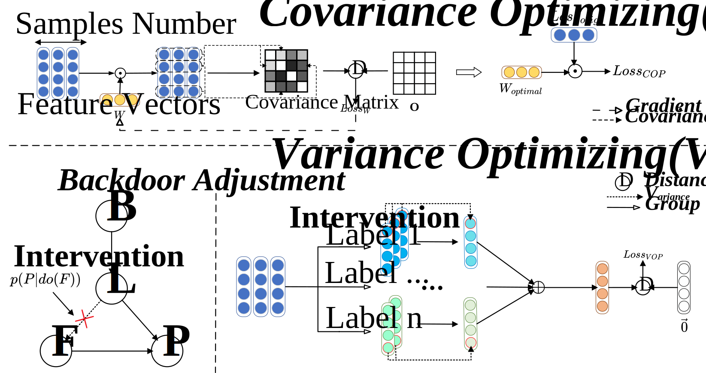
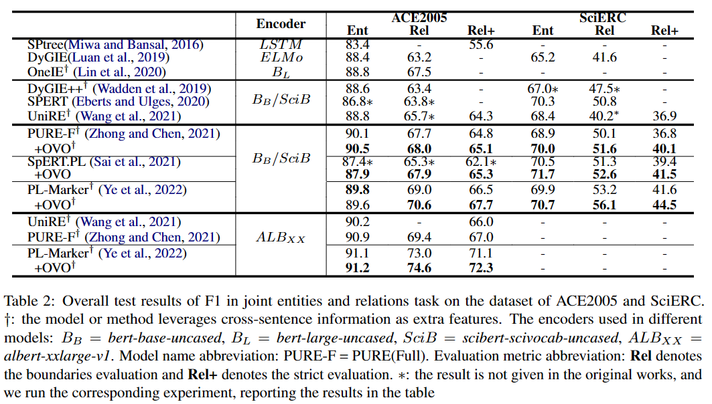

# CoVariance-based Causal Debiasing for Entity and Relation Extraction

OVO is a novel training framework for optimizing feature representations directly using causal technology. There are two main parts of OVO which are called COP and VOP. From the perspective of the correlation among features, COP reduces the spurious relation by minimizing the covariance computed from all features. From the viewpoint of each feature, VOP makes the feature more causal by minimizing the variance calculated from each feature of the same label.



# code

The codes for OVO are in `./code/OVO`.

We apply OVO on three baselines whose codes are located as follows:

- PURE: `./code/PURE`
- SpERT.PL: `./code/SpERT_PL`
- PL-Marker: `./code/PL-Marker`

The OVO's codes on each baseline are in `training` directory. For example, `./code/PURE/training`

# datasets

We use two widely used datasets that are available on the Internet.

- Ace2005: [https://catalog.ldc.upenn.edu/LDC2006T06](https://catalog.ldc.upenn.edu/LDC2006T06)
- SciERC: [http://nlp.cs.washington.edu/sciIE/](http://nlp.cs.washington.edu/sciIE/)

The locations of datasets are as follows:

```
PURE:
PURE
|-ace05
|-scierc_data

SpERT.PL
|-SpERT_PL
|-InputsAndOutputs
|--data
|---datasets
|----ace05
|----scierc

PL-Marker:
PURE
|-ace05
|-scierc
```

Note: For SpERT.PL, datasets are required to modify by `generate_augmented_input.py`.

# results

The results of baselines applying OVO are in `./results`. 

Note that the results are different because the prediction files of baselines are different.

The experiments in the paper are as follows:

